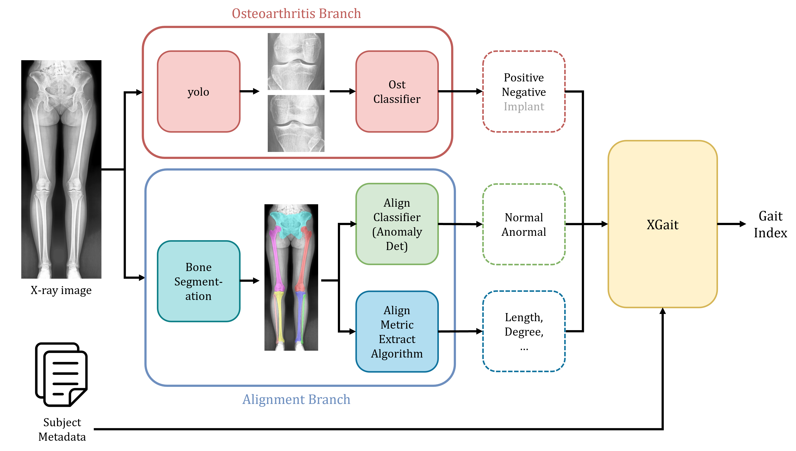

# XGait
Integrate codebase for X-ray based osteoarthritis detection, skeletal alignment abnormality detectionn, and gait pattern classification.


## Repository strucuture
```
xgait/
├── align_metric/     # Lower-limb alignment metric extraction script
├── anomalydet/       # Skeletal alignment anomaly detection model
├── asset/            # Figures and visual assets for documentation
├── boneseg/          # Bone segmentation model
├── dataset/          # Raw data, train/validation split files, and JSON annotations
├── ostdet/           # Osteoarthritis detection model
├── xgait/            # Gait pattern classification model
└── yolo_finetune/    # YOLO-based knee detector
```

## 🔥 To be added
* Subject metadata xslx file
* SNU dataset
* xgait model and train/test code
* requirements.txt file

## Activate virtual environment
You can activate the preconfigured conda environment named `biohub`:
```bash
conda activate biohub
```

Alternatively, you may create a new conda environment and install the required dependencies:
```bash
conda create -n [venv_name]
conda activate [venv_name]
cd xgait
pip install -r requirements.txt
```
